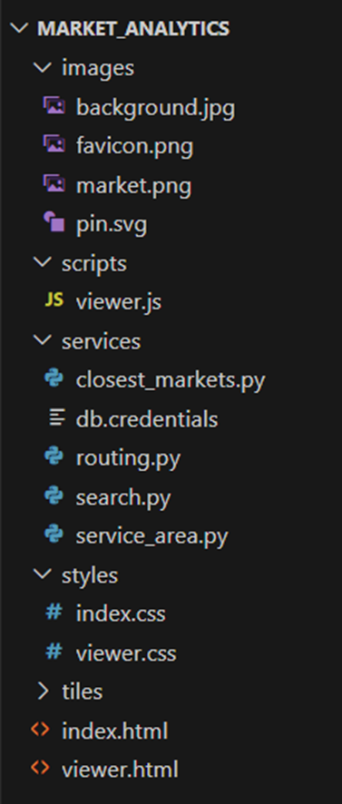

#  Burundi | Market Analytics webapp

                      

## Required software

#### Web browser: 
- Mozilla Firefox, Google Chrome, or Microsoft Edge.

 ### Web server:
A web server is a software application intended to store and serve web pages. It also enables the execution of   server-side code. For this project, we use the WAMP Server (users of macOS can use MAMP Server). Download and install it keeping all the default configuration values. If you get an error message indicating that the installation cannot continue because of missing VC++ packages, download and install the required packages from this link, and try again to install with the default configuration.

Once the WAMP server is installed, it is necessary to configure it to enable the execution of Python scripts. You will always need to restart the service after making changes to its configuration.

Open the file httpd.conf. In a default installation, this file is located in c:\wamp64\bin\apache\apache2.4.58\conf\httpd.conf. Look for the line `#AddHandler cgi-script .cgi`  and modify it to `AddHandler cgi-script .cgi .py` and also this line `Options +Indexes +FollowSymLinks +Multiviews` to `Options +Indexes +FollowSymLinks +Multiviews +ExecCGI` 

 restart the service for the changes to take effect

#### Python interpreter

The Python interpreter is responsible for the translation and execution of Python code. To check if there is a Python interpreter intalled in your system, open the Command Prompt and execute the command `python --version` If the command returns a version number, you have a Python interpreter intalled in your system. We recommend to work with version 3.7 or higher.

### Integrated Development Environment

An Integrated Development Environment (IDE) is a software that offers several programming tools into an integrated environment to enhance the software development process. Typically, an IDE includes tools such as a code editor, debugger, compiler/interpreter, and automation tools. For this tutorial, we recommend the IDE Visual Studio Code (VS Code). Download and install VS Code using the default configuration. Once installed, open Visual Studio Code and install the Python IntelliSense extension.

### Database Management System

A Database Management System (DBMS) is a software that provides functionality for the creation, organization, retrieval, and management of data within a database. For this project, we use PostgreSQL and its spatial extension PostGIS.

### File structure

All the files of the web app will be stored in a folder called market_analytics located in the www folder of the WAMP installation. 

The folder tiles contains a tailor-made raster tiled map for the study area (i.e., Burundi). A tiled map is a series of images of equal dimensions (e.g., 256 x 256 pixels) that can be seamlessly combined to depict an area of interest with scale-dependent details. Dividing a map into tiles speeds up the map loading because of the reduced size of each tile.

